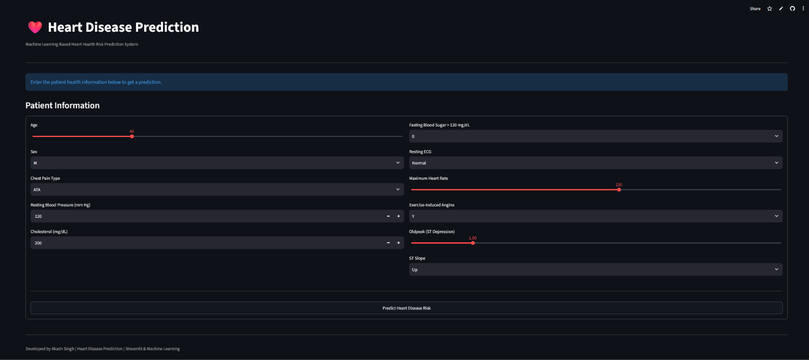

# ❤️ Heart Disease Prediction

A Machine Learning-based web application that predicts the likelihood of heart disease based on patient health-related information.

The project covers the complete Machine Learning workflow — **data preprocessing, exploratory data analysis, feature preparation, model training, evaluation, model serialization, and deployment using Streamlit**.

## 🌐 Live Demo

🚀 **Try the application:**
https://heart-disease-predictions-1.streamlit.app/

---

## 📌 Project Overview

Heart Disease Prediction is a supervised Machine Learning classification project developed to analyze patient health information and predict whether a patient is likely to have heart disease.

The project uses **Python, Pandas, NumPy, Scikit-learn, Matplotlib, Seaborn, and Streamlit**.

The trained model is integrated into a Streamlit web application where users can enter patient-related information and receive a prediction.

> **Important:** This application is intended for educational and demonstration purposes only. It is not a medical diagnostic tool and should not be used as a substitute for professional medical advice.

---

## 🎯 Objectives

* Analyze heart disease-related patient data.
* Perform data cleaning and preprocessing.
* Explore relationships between features using EDA.
* Prepare features for Machine Learning.
* Train and evaluate a classification model.
* Save the trained model using Joblib.
* Build an interactive Streamlit application.
* Deploy the application online.

---

## 📊 Dataset

The project uses a heart disease dataset containing patient health-related attributes.

### Main Features

The dataset includes features such as:

| Feature        | Description                      |
| -------------- | -------------------------------- |
| Age            | Age of the patient               |
| Sex            | Gender of the patient            |
| ChestPainType  | Type of chest pain               |
| RestingBP      | Resting blood pressure           |
| Cholesterol    | Cholesterol level                |
| FastingBS      | Fasting blood sugar indicator    |
| RestingECG     | Resting electrocardiogram result |
| MaxHR          | Maximum heart rate               |
| ExerciseAngina | Exercise-induced angina          |
| Oldpeak        | ST depression value              |
| ST_Slope       | Slope of the ST segment          |
| HeartDisease   | Target variable                  |

> The exact feature names depend on the version of `heart.csv` used in the project.

### Target Variable

**`HeartDisease`**

The target represents the classification outcome used by the Machine Learning model.

---

## 🔍 Exploratory Data Analysis

Exploratory Data Analysis was performed to understand the dataset and identify important patterns.

The analysis includes:

* Target variable distribution
* Age distribution
* Gender distribution
* Chest pain type analysis
* Cholesterol analysis
* Resting blood pressure analysis
* Maximum heart rate analysis
* Exercise-induced angina analysis
* Correlation analysis
* Feature relationships with the target variable

### 📈 Data Insights

Some important observations explored during the analysis include:

* Patient age is an important demographic variable for understanding the distribution of the dataset.
* Chest pain categories provide useful information for classification.
* Blood pressure and cholesterol are important health-related numerical variables.
* Maximum heart rate provides additional information about cardiovascular condition.
* Categorical features require suitable encoding before being provided to Machine Learning algorithms.
* Feature scaling is important for distance-based algorithms such as K-Nearest Neighbors.

> **Note:** The insights above describe analytical observations/workflow rather than medical conclusions.

---

## 🧹 Data Preprocessing

The following preprocessing steps were performed:

1. Loaded the dataset using Pandas.
2. Inspected the dataset structure.
3. Checked for missing values.
4. Checked data types.
5. Performed exploratory analysis.
6. Encoded categorical variables.
7. Separated features and target variable.
8. Split the dataset into training and testing sets.
9. Applied feature scaling.
10. Prepared the final feature set for model training.

### Preprocessing Workflow

```text
Raw Dataset
     ↓
Data Inspection
     ↓
Data Cleaning
     ↓
Categorical Encoding
     ↓
Feature / Target Separation
     ↓
Train-Test Split
     ↓
Feature Scaling
     ↓
Model Training
     ↓
Model Evaluation
```

---

## 🤖 Machine Learning Model

The project uses **K-Nearest Neighbors (KNN)** for classification.

### K-Nearest Neighbors

KNN is a supervised Machine Learning algorithm that predicts the class of a new observation based on the classes of its nearest data points.

The model uses the distance between observations to determine the most similar examples.

Because KNN is distance-based, **feature scaling is particularly important**.

### Model Pipeline

```text
Input Data
     ↓
Preprocessing
     ↓
Encoding
     ↓
Scaling
     ↓
KNN Model
     ↓
Prediction
     ↓
Heart Disease / No Heart Disease
```

---

## 📏 Model Evaluation

The Machine Learning model can be evaluated using classification metrics such as:

* Accuracy
* Precision
* Recall
* F1 Score
* Confusion Matrix

### Evaluation Metrics

| Metric           | Meaning                                                  |
| ---------------- | -------------------------------------------------------- |
| Accuracy         | Percentage of correctly classified observations          |
| Precision        | How many predicted positive cases were actually positive |
| Recall           | How many actual positive cases were correctly identified |
| F1 Score         | Harmonic mean of precision and recall                    |
| Confusion Matrix | Shows correct and incorrect predictions by class         |

For a healthcare-related classification problem, **accuracy alone should not be considered sufficient**. Precision, recall, F1-score, and the confusion matrix should also be examined.

---

## 💾 Saved Model Files

The repository contains the trained Machine Learning components required by the application:

```text
knn_heart_model.pkl
heart_scaler.pkl
heart_columns.pkl
```

### File Purpose

| File                  | Purpose                          |
| --------------------- | -------------------------------- |
| `knn_heart_model.pkl` | Saved KNN Machine Learning model |
| `heart_scaler.pkl`    | Saved feature scaler             |
| `heart_columns.pkl`   | Saved feature-column information |

Using saved preprocessing and model objects helps keep the prediction process consistent with the training process.

---

## 🖥️ Streamlit Application

The Streamlit application provides an interactive interface where users can enter the required health-related inputs.

### Application Workflow

```text
User Input
    ↓
Input Validation
    ↓
Feature Preparation
    ↓
Encoding / Column Alignment
    ↓
Feature Scaling
    ↓
Trained KNN Model
    ↓
Prediction
    ↓
Result Display
```

---

## ✨ Features

* ❤️ Heart disease prediction
* 🤖 Machine Learning-based classification
* 📊 Interactive Streamlit interface
* 🧹 Data preprocessing
* 📈 Exploratory Data Analysis
* 🔢 Feature scaling
* 💾 Saved ML model
* ⚡ Fast prediction
* 🌐 Online deployment

---

## 🛠️ Technologies Used

### Programming Language

* Python

### Data Analysis

* Pandas
* NumPy

### Data Visualization

* Matplotlib
* Seaborn

### Machine Learning

* Scikit-learn
* K-Nearest Neighbors (KNN)

### Model Persistence

* Joblib

### Web Application

* Streamlit

### Deployment

* Streamlit Community Cloud

---

## 📂 Project Structure

```text
Heart-Disease-Prediction/
│
├── HeartdiseaseFinal.ipynb
│       └── Data analysis, preprocessing and ML workflow
│
├── heart.csv
│       └── Heart disease dataset
│
├── app.py
│       └── Streamlit application
│
├── knn_heart_model.pkl
│       └── Trained KNN model
│
├── heart_scaler.pkl
│       └── Feature scaling object
│
├── heart_columns.pkl
│       └── Feature-column information
│
├── requirements.txt
│       └── Python dependencies
│
└── README.md
        └── Project documentation
```

---

## ⚙️ Installation

### 1. Clone the Repository

```bash
git clone https://github.com/AKASHPATEL-89/Heart-Disease-Prediction.git
```

### 2. Navigate to the Project

```bash
cd Heart-Disease-Prediction
```

### 3. Install Dependencies

```bash
pip install -r requirements.txt
```

### 4. Run the Streamlit Application

```bash
streamlit run app.py
```

The application will open in your browser.

---

## 📦 Requirements

The project uses the following Python libraries:

```text
streamlit
pandas
numpy
scikit-learn
matplotlib
seaborn
joblib
```

All dependencies are available in:

```text
requirements.txt
```

---

## 🚀 Deployment

The application is deployed using **Streamlit Community Cloud**.

### Live Application

https://heart-disease-predictions-1.streamlit.app/

---

## 🧠 Skills Demonstrated

This project demonstrates practical knowledge of:

* Python programming
* Pandas data manipulation
* NumPy
* Exploratory Data Analysis
* Data visualization
* Categorical encoding
* Feature scaling
* Train-test splitting
* Supervised Machine Learning
* Classification
* K-Nearest Neighbors
* Model evaluation
* Model serialization
* Streamlit development
* ML application deployment
* Git and GitHub

---

## 📌 Key Learning Outcomes

Through this project, I practiced an end-to-end Machine Learning workflow:

```text
Problem Definition
       ↓
Data Collection
       ↓
Data Understanding
       ↓
Data Cleaning
       ↓
EDA
       ↓
Feature Engineering / Encoding
       ↓
Train-Test Split
       ↓
Feature Scaling
       ↓
Model Training
       ↓
Model Evaluation
       ↓
Model Saving
       ↓
Streamlit Application
       ↓
Deployment
```

---

## ⚠️ Limitations

* The model is trained on a specific dataset and may not generalize to every population.
* Model predictions depend on the quality and distribution of the training data.
* A Machine Learning prediction should not be treated as a medical diagnosis.
* Real-world healthcare applications require extensive validation, clinical expertise, and appropriate regulatory review.

---

## 🔮 Future Improvements

Possible future improvements include:

* Compare KNN with Logistic Regression, Decision Tree, Random Forest, SVM, and other classifiers.
* Perform hyperparameter tuning using `GridSearchCV` or `RandomizedSearchCV`.
* Add ROC-AUC analysis.
* Add confusion matrix visualization to the application.
* Add feature importance / model explainability where appropriate.
* Improve UI/UX of the Streamlit application.
* Add automated model retraining.
* Add proper experiment tracking and model versioning.
* Add a more comprehensive model comparison dashboard.

---

## 📸 Application Preview

Add screenshots of your deployed Streamlit application here:





You can add screenshots such as:

* Home page
* Input section
* Prediction result
* EDA visualizations

---

## 👨‍💻 Author

**Akash Singh**

B.Tech Computer Science & Engineering

### GitHub

https://github.com/AKASHPATEL-89

---

## ⭐ Support

If you found this project useful, consider giving the repository a ⭐ on GitHub.

---

## ⚕️ Disclaimer

This project is created for **educational and portfolio purposes**.

The predictions generated by this application should **not be considered medical advice, diagnosis, or treatment recommendations**. Users should consult qualified healthcare professionals for medical decisions.
